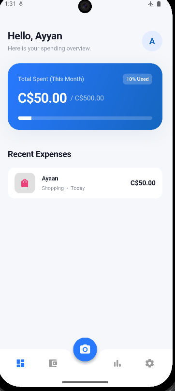
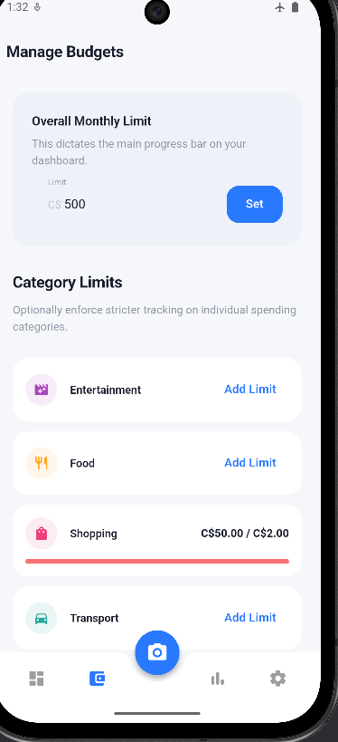

# SnapSpend 📸💲

SnapSpend is an offline-first, AI-powered personal expense tracker built with Flutter. It utilizes on-device Machine Learning (Google ML Kit) to automatically scan, crop, and extra totals from physical receipts without ever requiring a cloud connection.


  
  

## Features ✨

* **AI Receipt Scanning:** Just snap a picture of your physical receipt. Google ML Kit natively crops the image and extracts the grand total automatically using the Latin text-recognizer engine.
* **Offline-First Storage:** Driven entirely natively via [Hive](https://pub.dev/packages/hive), an incredibly fast NoSQL local database. No user accounts, APIs, or internet required!
* **Categorized Budgeting:** Dynamically assign limits to Custom Categories and track monthly caps across the dashboard universally.
* **Insight Analytics:** Visualize 6-Month historical tracking and current-month categorized breakdowns via embedded `fl_chart` projections.
* **Universal Localization:** Customizable currency parameter settings and User Profiles that instantly cascade via `Provider`.

## Tech Stack 🛠️

* **Framework:** [Flutter](https://flutter.dev/) (Dart)
* **State Management:** MVVM using [Provider](https://pub.dev/packages/provider)
* **Local Database:** [Hive](https://pub.dev/packages/hive) & `hive_flutter`
* **Machine Learning:** 
  * `google_mlkit_document_scanner` (Native edge-detection & cropping)
  * `google_mlkit_text_recognition` (OCR pipeline parsing totals and taxes)
* **Data Visualization:** `fl_chart`

## Getting Started 🚀

### Prerequisites
* Flutter SDK (3.20.0 or higher)
* **Android Physical Device (Camera Requirement):** Google ML Kit document scanner strictly requires a physical Android device to mount the camera intent. *It will crash on Android Emulators.*

### Installation runbook

1. Clone this repository:
   ```bash
   git clone https://github.com/yourusername/snapsend.git
   cd SnapSend
   ```

2. Fetch all dependencies:
   ```bash
   flutter pub get
   ```

3. Generate Hive serialization models (Run whenever you modify models!):
   ```bash
   dart run build_runner build --delete-conflicting-outputs
   ```

4. Connect your physical Android Device via USB debugging and run:
   ```bash
   flutter run
   ```

## Creating a Production Build 📦

Because we implement native Google ML Kit dependencies, you must apply R8 minifier configuration rules before building a release version. We have already injected `-dontwarn com.google.mlkit.vision.text.**` inside `android/app/proguard-rules.pro`. 

To generate a deployable release APK:

```bash
flutter build apk --release
```

You will find the generated universal APK inside:  
`build/app/outputs/flutter-apk/app-release.apk`


