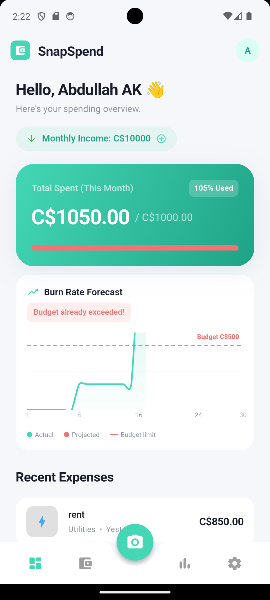
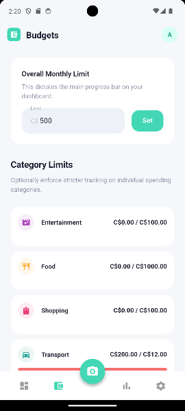

# SnapSpend 📸💲

SnapSpend is an offline-first, AI-powered personal finance & budgeting app built with Flutter. It utilizes on-device Machine Learning (Google ML Kit) to automatically scan physical receipts and provides a comprehensive suite of tools to manage your income, budgets, and spending health.




## Core Features ✨

* **AI Receipt Scanning:** Just snap a picture of your physical receipt. Google ML Kit natively crops the image and extracts the grand total automatically using a local OCR pipeline.
* **Full Income Tracking:** Log your salary, freelance earnings, or bonuses. The app provides a live "Cash Flow" balance (Income vs. Expenses) so you always know your true net worth.
* **Smart Budget Rollover:** unspent money from last month doesn't just disappear—SnapSpend automatically rolls it over to increase your available budget for the current month.
* **Budget Health Reports:** Get actionable advice when you're over-budget. The app identifies "Culprit Categories" and calculates a daily allowance to help you stay on track.
* **Offline-First Privacy:** All data is stored locally via [Hive](https://pub.dev/packages/hive). No cloud, no account creation, and no data tracking. Your finances stay on your phone.
* **Premium Analytics:** Visualize your financial journey with smooth Area Charts for trends and clean Donut Charts for category breakdowns.

## Tech Stack 🛠️

* **Framework:** [Flutter](https://flutter.dev/) (Dart)
* **State Management:** MVVM Architecture using [Provider](https://pub.dev/packages/provider)
* **Local Database:** [Hive](https://pub.dev/packages/hive) (NoSQL) for high-performance persistence.
* **Machine Learning:** 
  * `google_mlkit_document_scanner` (Native edge-detection & cropping)
  * `google_mlkit_text_recognition` (OCR engine for total extraction)
* **Data Visualization:** `fl_chart` for responsive, interactive graphs.

## Getting Started 🚀

### Prerequisites
* Flutter SDK (3.20.0 or higher)
* **Android Physical Device:** Required for the Receipt Scanner. *Emulators do not support the native ML Kit camera intent.*

### Installation & Local Setup

1. **Clone the repository:**
   ```bash
   git clone https://github.com/YOUR_USERNAME/snapsend.git
   cd snapsend
   ```

2. **Fetch dependencies:**
   ```bash
   flutter pub get
   ```

3. **Generate Database Adapters:**
   Since SnapSpend uses Hive for local storage, you **must** generate the serialization code before the app will run:
   ```bash
   dart run build_runner build --delete-conflicting-outputs
   ```

4. **Run the app:**
   Connect your physical device and run:
   ```bash
   flutter run
   ```

## Development & Pushing Changes 🤝

When contributing to this project or pushing your own updates:

1. **Keep it clean:** Always run the `build_runner` command after modifying any models (`.dart` files in `lib/data/models`).
2. **Platform Config:** Ensure `CAMERA` permissions are maintained in `AndroidManifest.xml` for scanning.
3. **Commit often:** Use descriptive messages like `git commit -m "Added rollover logic"`.

## Creating a Production Build 📦

To generate a signed release APK:

```bash
flutter build apk --release
```

The APK will be located at:  
`build/app/outputs/flutter-apk/app-release.apk`
